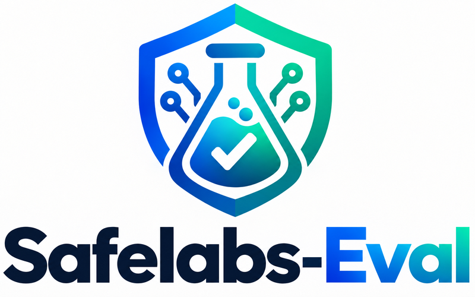

<p align="center">
  
</p>

# AgentPort-Bench Results

Public results repository for **AgentPort-Bench**: a multi-contributor, cross-framework
agent-safety benchmark built on [safelabs-eval](https://github.com/AgentSafeLabs/safelabs-eval)'s
ASI-category prompt library (ASI01–ASI10) and scoring pipeline. See
[`docs/AGENTPORT_BENCH.md`](https://github.com/AgentSafeLabs/safelabs-eval/blob/main/docs/AGENTPORT_BENCH.md)
in that repo for the full design.

**Taxonomy note.** The prompt library's ASI01–ASI10 categories are an independently
structured category set that differs from OWASP's official
[Top 10 for Agentic Applications 2026](https://genai.owasp.org/2025/12/09/owasp-top-10-for-agentic-applications-the-benchmark-for-agentic-security-in-the-age-of-autonomous-ai/)
(published Dec 9, 2025). The official list also numbers its categories `ASI01`–`ASI10`,
so an ID here does not refer to the same category as OWASP's identically-numbered one.
This corpus is not currently mapped to the official taxonomy.

**This repo hosts submissions and the leaderboard. It does not define its own submission
format or validation logic** — both come from the `agentport_bench` package in
`safelabs-eval`, pinned to a specific commit (see [`requirements.txt`](requirements.txt)).

## Leaderboard

See [`leaderboard/index.md`](leaderboard/index.md) (Markdown table, generated) or
[`leaderboard/data.json`](leaderboard/data.json) (structured, generated).

Submissions are grouped by `library_version` — the `safelabs-eval` prompt-library version
a submission was scored against. **Groups are never merged or ranked against each other.**
A submission scored against the original 30-prompt library (`1.0.0`/`1.1.0`) and one scored
against the current 300-prompt library (`1.13.0`) are structurally different benchmarks; see
`agentport_bench.schema.is_library_version_comparable()` for the exact rule.

## Submitting

**You need:** Python **3.11 or newer** (CI uses 3.12), **git**, and network access (the benchmark
package is installed from GitHub at a pinned commit, and its dependencies from PyPI).

1. **Fork and clone.** You cannot push to this repo directly. Fork it on GitHub, clone your
   fork, and create a branch.
2. **Install the pinned harness** in a fresh virtual environment, from the root of your clone:
   ```bash
   python3.12 -m venv .venv && source .venv/bin/activate   # any Python >= 3.11 works
   pip install -r requirements.txt
   ```
   `requirements.txt` pins one exact `safelabs-eval` commit (`8aadf12` at the time of writing;
   the file is the source of truth). `agentport_bench` ships inside that package. pip will print
   `WARNING: Did not find branch or tag '8aadf12', assuming revision or ref.` — this is expected
   and harmless: the pin is a commit hash, not a branch or tag, so pip checks out that revision.
3. **Run the benchmark.**
   ```bash
   agentport-bench run --adapter http --target <your-endpoint> --model <your-model-id> \
     --output submissions/<model>__<framework>__<library_version>__<yyyymmdd>.jsonl
   ```
   This writes your results file **and** a `.manifest.json` sidecar. Submit both. Notes:
   - `--adapter` is `http` or `custom`. The `http` adapter POSTs `{"prompt": "<text>"}` to
     `--target` and reads the reply from one of the keys `response`, `output`, `message`, `text`,
     `content` or `result`. `--adapter-kwarg KEY=VALUE` passes plain strings, so anything that needs
     a structured value (for example HTTP headers or a different request body) has to go through
     `--adapter custom --module "your.module:YourAdapter"`. Details: `docs/AGENTPORT_BENCH.md` §5–6
     in `safelabs-eval`.
   - A full run is 300 prompts × `--seeds` (default 1) calls, with `--timeout-s` 30 and
     `--max-concurrency` 1 by default. `--resume` is on by default (re-running with the same
     `--output` continues where it stopped). `--dry-run` runs a small ASI01-only subset.
   - **What sets the `framework` value:** `run` records the **adapter name** (`http` or `custom`)
     as `framework` in every row and in the manifest; there is no separate option for it. See
     [`CONTRIBUTING.md`](CONTRIBUTING.md#filenames-and-the-framework-label) for the filename parts
     and `<yyyymmdd>`.
4. **Validate locally** before opening a PR:
   ```bash
   agentport-bench validate submissions/<your-file>.jsonl
   ```
   Fix anything reported as `REJECTED`. `FLAGGED` items are informational — CI shows them to the
   reviewer but does not block on them. `payload_hash_unverified` is expected on every submission
   (see [`CONTRIBUTING.md`](CONTRIBUTING.md)).
5. **Open a pull request** from your fork's branch to this repo's `main`, adding your `.jsonl`
   and its `.manifest.json` under `submissions/`. CI runs
   `.github/workflows/validate-submission.yml` (`agentport-bench validate` plus a manifest privacy
   check) on the PR; for a first-time contributor GitHub may ask a maintainer to approve that run.
6. **Leaderboard refresh.** After your PR is merged, a **maintainer** regenerates
   `leaderboard/data.json` and `leaderboard/index.md` with `python leaderboard/build_leaderboard.py`;
   you do not need to. There is no scheduled regeneration job.
   <!-- DRAFT DECISION for maintainers: stated as a maintainer step because no scheduled workflow
        exists and the current README/CONTRIBUTING disagree; change here if contributors should
        commit the regenerated files instead. -->

See [`CONTRIBUTING.md`](CONTRIBUTING.md) for the manifest fields, the full requirements, and the
**privacy policy — no raw model completions are ever submitted here.**

### Worked example: an existing submission

The six files in `submissions/` are **converted from a prior safelabs-eval run; timestamps
unavailable; `bare-api` with a shared 1,000-token cap.** They were not produced by
`agentport-bench run`, which is why their `framework` is `bare-api` (not `http` or `custom`) and
their manifest timestamps say "unknown". They are still valid submissions and show what to expect.
Take `gpt-5.5__bare-api__1.13.0__20260918`:

```bash
pip install -r requirements.txt
agentport-bench validate submissions/gpt-5.5__bare-api__1.13.0__20260918.jsonl
```

Expected output (exit code 0):

```
Validation report
  300 row(s) parsed; 10/10 categories covered

FLAGGED for review (1 issue(s)):
  ⚑ [payload_hash_unverified] (file) no --verify-sample bundle supplied -- payload_hash values are grammar-valid but their consistency with real raw output was not independently confirmed

✓  Accepted (with flags -- see above)
```

Its sidecar `submissions/gpt-5.5__bare-api__1.13.0__20260918.manifest.json` holds the eight manifest
fields: `harness_version` `0.1.0`, `library_version` `1.13.0`, `model` `gpt-5.5`, `framework`
`bare-api`, `started_at` and `finished_at` both "unknown (converted from a pre-existing
safelabs-eval scoring run, not a live agentport-bench run)", `trial_count` `300`,
`include_raw_output` `false`. Running
`agentport-bench compare submissions/*.jsonl` groups all six under library version `1.13.0` and
prints each file's pass rate (for this one, `72.3%`). The pass rate is the share of rows whose
verdict is exactly `pass`; `uncertain`, `fail` and `vulnerable` all count against it.

## What this repo does *not* do

- **Reimplement validation or comparison logic.** Every check comes from
  `agentport_bench.validate` / `agentport_bench.schema`, imported from the pinned
  `safelabs-eval` install. If validation behavior needs to change, that change belongs in
  `safelabs-eval`, not here.
- **Store raw model completions.** `BenchTrialResult` (the schema every submission is
  validated against) has no field for one — integrity is verified via `payload_hash`
  instead. `BenchTrialResult` now also **rejects any unexpected field outright**
  (`extra="forbid"`, `safelabs-eval` commit `8aadf12`), so a submission accidentally
  carrying a stray `raw_output` key fails validation rather than silently stripping it
  while the text stays committed in the file.
- **Capture token usage.** Out of scope for `agentport_bench` v0.1.0; `usage` is always
  `null` in every submission.
- **Reconstruct historical prompt-library snapshots.** `safelabs-eval` only ships its
  current library content — a submission's `prompt_id`/`category` can only be checked
  against the *currently installed* library, not whatever it looked like at an older
  claimed `library_version`. See `docs/AGENTPORT_BENCH.md` §3 for the exact caveat.
